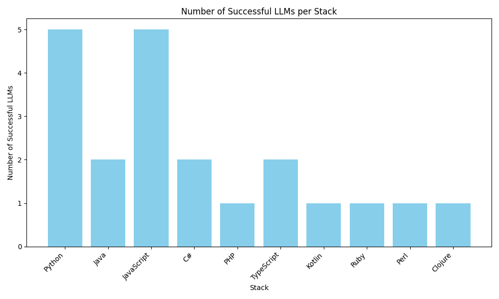
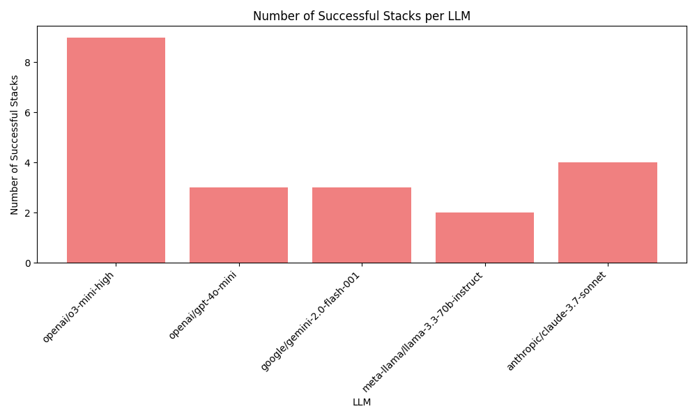

# Test Report

This report summarizes the results of LLM tests across different stacks.

## Detailed Test Results

| LLM                               | Stack       | Status     | Cost    |   Time (s) |   Steps |   Attempts |   Input Tokens |   Output Tokens |
|-----------------------------------|-------------|------------|---------|------------|---------|------------|----------------|-----------------|
| openai/o3-mini-high               | Python      | ✅ Success | $0.0494 |     310.91 |       3 |          2 |           8252 |            9153 |
| openai/gpt-4o-mini                | Python      | ✅ Success | $0.0057 |      67.22 |       8 |          2 |          31091 |            1705 |
| google/gemini-2.0-flash-001       | Python      | ✅ Success | $0.0036 |      39.81 |       4 |          1 |          20876 |            3759 |
| meta-llama/llama-3.3-70b-instruct | Python      | ✅ Success | $0.0042 |     150.93 |       7 |          2 |          28065 |            2762 |
| openai/o3-mini-high               | Java        | ✅ Success | $0.0462 |     221.35 |       4 |          2 |          10548 |            7854 |
| openai/gpt-4o-mini                | Java        | ❌ Failure | $0.0667 |     174.93 |      24 |          5 |         423908 |            5133 |
| google/gemini-2.0-flash-001       | Java        | ❌ Failure | $0.0320 |     117.78 |      22 |          5 |         279969 |            9885 |
| meta-llama/llama-3.3-70b-instruct | Java        | ❌ Failure | $0.0295 |     627.68 |      24 |          5 |         225451 |            8042 |
| openai/o3-mini-high               | JavaScript  | ✅ Success | $0.0180 |      45.81 |       2 |          1 |           2875 |            3370 |
| openai/gpt-4o-mini                | JavaScript  | ✅ Success | $0.0044 |      57.79 |       7 |          2 |          23459 |            1401 |
| google/gemini-2.0-flash-001       | JavaScript  | ✅ Success | $0.0065 |      70.32 |       7 |          2 |          42054 |            5630 |
| meta-llama/llama-3.3-70b-instruct | JavaScript  | ✅ Success | $0.0187 |    2064.8  |      18 |          4 |         132770 |            9089 |
| openai/o3-mini-high               | C++         | ❌ Failure | $0.8258 |     564.73 |      18 |          5 |         516146 |           58647 |
| openai/gpt-4o-mini                | C++         | ❌ Failure | $0.1900 |     327.29 |      21 |          5 |        1250496 |            4068 |
| google/gemini-2.0-flash-001       | C++         | ❌ Failure | $0.0114 |     135.81 |       6 |          3 |          99873 |            3466 |
| meta-llama/llama-3.3-70b-instruct | C++         | ❌ Failure | $0.0110 |     493.33 |      11 |          3 |          75197 |            6528 |
| openai/o3-mini-high               | C#          | ✅ Success | $0.0458 |     122.62 |       3 |          1 |           7993 |            8422 |
| openai/gpt-4o-mini                | C#          | ❌ Failure | $0.0220 |      81.25 |      17 |          3 |         121338 |            6264 |
| google/gemini-2.0-flash-001       | C#          | ❌ Failure | $0.0130 |     136.1  |      18 |          3 |         118037 |            2903 |
| meta-llama/llama-3.3-70b-instruct | C#          | ❌ Failure | $0.0059 |     339.33 |       7 |          3 |          42245 |            2900 |
| openai/o3-mini-high               | PHP         | ❌ Failure | $0.1773 |     400.52 |      12 |          3 |         109912 |           12826 |
| openai/gpt-4o-mini                | PHP         | ✅ Success | $0.0065 |      64.7  |       6 |          2 |          36510 |            1742 |
| google/gemini-2.0-flash-001       | PHP         | ❌ Failure | $0.0396 |     156.2  |      16 |          3 |         325005 |           17653 |
| meta-llama/llama-3.3-70b-instruct | PHP         | ❌ Failure | $0.0349 |     384.63 |      14 |          3 |         271389 |            7623 |
| openai/o3-mini-high               | Rust        | ❌ Failure | $0.0796 |     101.93 |       6 |          3 |          26746 |           11402 |
| openai/gpt-4o-mini                | Rust        | ❌ Failure | $0.0099 |     302    |       6 |          3 |          55285 |            2654 |
| google/gemini-2.0-flash-001       | Rust        | ❌ Failure | $0.0096 |     174.41 |      10 |          3 |          80498 |            3773 |
| anthropic/claude-3.7-sonnet       | Python      | ✅ Success | $0.4478 |     188.66 |      10 |          2 |          99718 |            9910 |
| anthropic/claude-3.7-sonnet       | Java        | ✅ Success | $1.5004 |     481.97 |      18 |          2 |         352789 |           29471 |
| anthropic/claude-3.7-sonnet       | JavaScript  | ✅ Success | $0.1620 |      78.37 |       7 |          1 |          37594 |            3283 |
| anthropic/claude-3.7-sonnet       | C++         | ❌ Failure | $3.3085 |     694.97 |      19 |          3 |         924792 |           35605 |
| anthropic/claude-3.7-sonnet       | C#          | ✅ Success | $0.3014 |     119.69 |      10 |          1 |          68426 |            6410 |
| meta-llama/llama-3.3-70b-instruct | Rust        | ❌ Failure | $0.0249 |     510.2  |      18 |          3 |         186326 |            8579 |
| openai/o3-mini-high               | TypeScript  | ✅ Success | $0.0354 |      92.05 |       4 |          2 |          10271 |            5477 |
| openai/gpt-4o-mini                | TypeScript  | ❌ Failure | $0.0129 |      70.2  |      13 |          3 |          71469 |            3646 |
| google/gemini-2.0-flash-001       | TypeScript  | ✅ Success | $0.0255 |     166.44 |      12 |          3 |         164924 |           22553 |
| meta-llama/llama-3.3-70b-instruct | TypeScript  | ❌ Failure | $0.0093 |     440.17 |      10 |          3 |          62877 |            5851 |
| openai/o3-mini-high               | Go          | ❌ Failure | $0.6493 |    1011.69 |      17 |          3 |         244956 |           86327 |
| openai/gpt-4o-mini                | Go          | ❌ Failure | $0.0141 |      60.07 |      10 |          3 |          71136 |            5739 |
| google/gemini-2.0-flash-001       | Go          | ❌ Failure | $0.0144 |      74.7  |      10 |          3 |         103226 |           10136 |
| meta-llama/llama-3.3-70b-instruct | Go          | ❌ Failure | $0.0132 |     903.14 |      10 |          3 |          88306 |            8527 |
| openai/o3-mini-high               | Kotlin      | ✅ Success | $0.3862 |     696.62 |      12 |          3 |         164604 |           46630 |
| openai/gpt-4o-mini                | Kotlin      | ❌ Failure | $0.0142 |      48.73 |      15 |          3 |          81447 |            3314 |
| google/gemini-2.0-flash-001       | Kotlin      | ❌ Failure | $0.0080 |      48.35 |      10 |          3 |          59427 |            5171 |
| meta-llama/llama-3.3-70b-instruct | Kotlin      | ❌ Failure | $0.0078 |     547.04 |       9 |          3 |          50944 |            5692 |
| openai/o3-mini-high               | Ruby        | ✅ Success | $0.0466 |     133.56 |       4 |          2 |           8524 |            8471 |
| openai/gpt-4o-mini                | Ruby        | ❌ Failure | $0.0162 |     200.17 |      11 |          3 |          78180 |            7400 |
| google/gemini-2.0-flash-001       | Ruby        | ❌ Failure | $0.0068 |     131.53 |       9 |          3 |          45153 |            5761 |
| meta-llama/llama-3.3-70b-instruct | Ruby        | ❌ Failure | $0.0094 |     231.28 |      12 |          3 |          68070 |            4136 |
| openai/o3-mini-high               | Scala       | ❌ Failure | $0.0978 |     146.42 |       7 |          3 |          26517 |           15597 |
| openai/gpt-4o-mini                | Scala       | ❌ Failure | $0.0117 |      49.79 |       9 |          3 |          68935 |            2306 |
| google/gemini-2.0-flash-001       | Scala       | ❌ Failure | $0.0246 |     143.91 |      11 |          3 |         177362 |           17266 |
| meta-llama/llama-3.3-70b-instruct | Scala       | ❌ Failure | $0.0148 |     907.88 |      11 |          3 |          98634 |            9854 |
| openai/o3-mini-high               | Haskell     | ❌ Failure | $0.4773 |     716.76 |      14 |          3 |         251343 |           45638 |
| openai/gpt-4o-mini                | Haskell     | ❌ Failure | $0.0019 |     245.85 |       3 |          3 |           8159 |            1049 |
| google/gemini-2.0-flash-001       | Haskell     | ❌ Failure | $0.0093 |     157.78 |      12 |          3 |          78749 |            3515 |
| meta-llama/llama-3.3-70b-instruct | Haskell     | ❌ Failure | $0.0161 |     457.41 |      17 |          3 |         116948 |            6797 |
| openai/o3-mini-high               | Perl        | ✅ Success | $0.0896 |     138.11 |       6 |          2 |          27142 |           13568 |
| openai/gpt-4o-mini                | Perl        | ❌ Failure | $0.0085 |     671.23 |       9 |          3 |          40512 |            4077 |
| google/gemini-2.0-flash-001       | Perl        | ❌ Failure | $0.9946 |    1334.14 |      20 |          3 |        9848823 |           24207 |
| meta-llama/llama-3.3-70b-instruct | Perl        | ❌ Failure | $0.0060 |     646.46 |       9 |          3 |          37460 |            4885 |
| openai/o3-mini-high               | Raku        | ❌ Failure | $0.0843 |     398.8  |       6 |          3 |          24155 |           13131 |
| openai/gpt-4o-mini                | Raku        | ❌ Failure | $0.0028 |      81.06 |       5 |          3 |          13821 |            1216 |
| google/gemini-2.0-flash-001       | Raku        | ❌ Failure | $0.0333 |     171.99 |      10 |          3 |         265968 |           16737 |
| meta-llama/llama-3.3-70b-instruct | Raku        | ❌ Failure | $0.0107 |     427.93 |      10 |          3 |          67952 |            8395 |
| openai/o3-mini-high               | Clojure     | ✅ Success | $0.3550 |     582.87 |      13 |          3 |         147030 |           43916 |
| openai/gpt-4o-mini                | Clojure     | ❌ Failure | $0.0210 |     161.16 |      13 |          3 |         128241 |            2902 |
| google/gemini-2.0-flash-001       | Clojure     | ❌ Failure | $0.0287 |     293.96 |      10 |          3 |         256990 |            7463 |
| meta-llama/llama-3.3-70b-instruct | Clojure     | ❌ Failure | $0.0134 |     339.86 |      16 |          3 |          96686 |            6000 |
| openai/o3-mini-high               | Common Lisp | ❌ Failure | $0.1323 |     234.47 |       7 |          3 |          39665 |           20155 |
| openai/gpt-4o-mini                | Common Lisp | ❌ Failure | $0.0232 |     335.47 |      12 |          3 |         121130 |            8305 |
| google/gemini-2.0-flash-001       | Common Lisp | ❌ Failure | $0.0116 |      77.98 |       9 |          3 |          84121 |            7883 |
| meta-llama/llama-3.3-70b-instruct | Common Lisp | ❌ Failure | $0.0094 |     312.83 |      10 |          3 |          63799 |            5870 |
| openai/o3-mini-high               | OCAML       | ❌ Failure | $0.3383 |     697.53 |      12 |          3 |         127297 |           45054 |
| openai/gpt-4o-mini                | OCAML       | ❌ Failure | $0.0096 |     183.82 |       9 |          3 |          54194 |            2387 |
| google/gemini-2.0-flash-001       | OCAML       | ❌ Failure | $0.0429 |     529.14 |      11 |          3 |         300881 |           32040 |
| meta-llama/llama-3.3-70b-instruct | OCAML       | ❌ Failure | $0.0238 |    1029.52 |      19 |          3 |         172320 |           10373 |
| openai/o3-mini-high               | D lang      | ❌ Failure | $0.1504 |     341.26 |       7 |          3 |          34980 |           25432 |
| openai/gpt-4o-mini                | D lang      | ❌ Failure | $0.0064 |      30.61 |       9 |          3 |          35172 |            1801 |
| google/gemini-2.0-flash-001       | D lang      | ❌ Failure | $0.0138 |     121.19 |       9 |          3 |         123737 |            3469 |
| meta-llama/llama-3.3-70b-instruct | D lang      | ❌ Failure | $0.0140 |     618.89 |      13 |          3 |          93163 |            9537 |
| openai/o3-mini-high               | Elixir      | ❌ Failure | $0.4694 |     495.55 |      14 |          3 |         198051 |           57179 |
| openai/gpt-4o-mini                | Elixir      | ❌ Failure | $0.0181 |     143.34 |      16 |          3 |         103814 |            4267 |
| google/gemini-2.0-flash-001       | Elixir      | ❌ Failure | $0.0036 |     259.43 |       3 |          3 |          18180 |            4350 |
| meta-llama/llama-3.3-70b-instruct | Elixir      | ❌ Failure | $0.0117 |     457.78 |      11 |          3 |          78096 |            7822 |
| openai/o3-mini-high               | Idris       | ❌ Failure | $0.5677 |     523.61 |      15 |          3 |         253912 |           65545 |
| openai/gpt-4o-mini                | Idris       | ❌ Failure | $0.0070 |     177.08 |       9 |          3 |          37372 |            2285 |
| google/gemini-2.0-flash-001       | Idris       | ❌ Failure | $0.0129 |      86.16 |       9 |          3 |          73224 |           14039 |
| meta-llama/llama-3.3-70b-instruct | Idris       | ❌ Failure | $0.0044 |     304.86 |       8 |          3 |          27255 |            3657 |

## Stack Success Summary

| Stack      |   Successful LLMs |
|------------|-------------------|
| Python     |                 5 |
| Java       |                 2 |
| JavaScript |                 5 |
| C#         |                 2 |
| PHP        |                 1 |
| TypeScript |                 2 |
| Kotlin     |                 1 |
| Ruby       |                 1 |
| Perl       |                 1 |
| Clojure    |                 1 |

## LLM Success Summary

| LLM                               |   Successful Stacks |
|-----------------------------------|---------------------|
| openai/o3-mini-high               |                   9 |
| openai/gpt-4o-mini                |                   3 |
| google/gemini-2.0-flash-001       |                   3 |
| meta-llama/llama-3.3-70b-instruct |                   2 |
| anthropic/claude-3.7-sonnet       |                   4 |

## Top 10 Cheapest Successful Tests

| LLM                               | Stack      | Cost    |
|-----------------------------------|------------|---------|
| google/gemini-2.0-flash-001       | Python     | $0.0036 |
| meta-llama/llama-3.3-70b-instruct | Python     | $0.0042 |
| openai/gpt-4o-mini                | JavaScript | $0.0044 |
| openai/gpt-4o-mini                | Python     | $0.0057 |
| google/gemini-2.0-flash-001       | JavaScript | $0.0065 |
| openai/gpt-4o-mini                | PHP        | $0.0065 |
| openai/o3-mini-high               | JavaScript | $0.0180 |
| meta-llama/llama-3.3-70b-instruct | JavaScript | $0.0187 |
| google/gemini-2.0-flash-001       | TypeScript | $0.0255 |
| openai/o3-mini-high               | TypeScript | $0.0354 |

## Top 10 Fastest Successful Tests

| LLM                         | Stack      |   Time (s) |
|-----------------------------|------------|------------|
| google/gemini-2.0-flash-001 | Python     |      39.81 |
| openai/o3-mini-high         | JavaScript |      45.81 |
| openai/gpt-4o-mini          | JavaScript |      57.79 |
| openai/gpt-4o-mini          | PHP        |      64.7  |
| openai/gpt-4o-mini          | Python     |      67.22 |
| google/gemini-2.0-flash-001 | JavaScript |      70.32 |
| anthropic/claude-3.7-sonnet | JavaScript |      78.37 |
| openai/o3-mini-high         | TypeScript |      92.05 |
| anthropic/claude-3.7-sonnet | C#         |     119.69 |
| openai/o3-mini-high         | C#         |     122.62 |

## Visualizations

